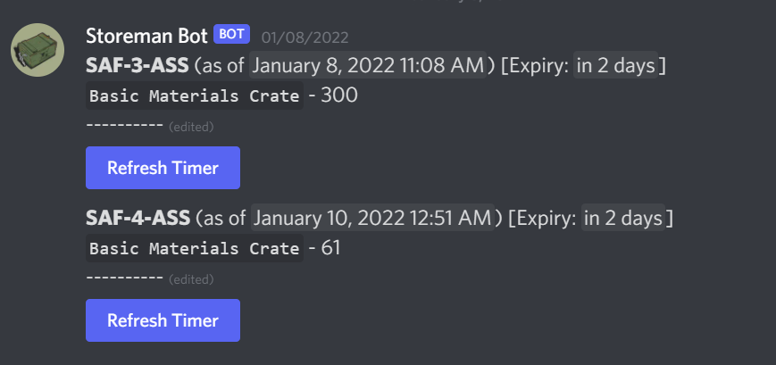
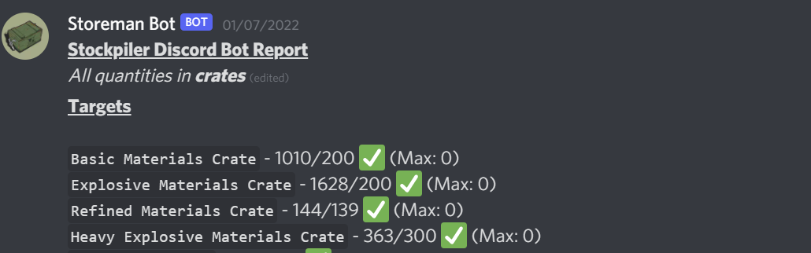
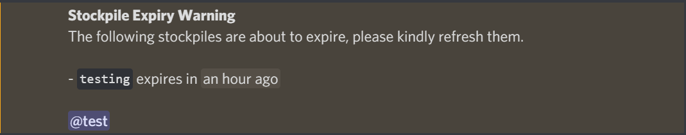
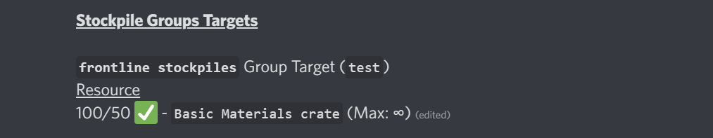

# Storeman Bot - The Foxhole Stockpile Discord Companion Bot
### [Discord Invite Link](https://discord.com/oauth2/authorize?client_id=946968895170969620&permissions=2147617792&scope=bot%20applications.commands) [Verified at last]

❗❗❗**Notice:** `Bot Host` has been changed to `http://storeman-bot.tk`❗❗❗

## What is this?

This is a companion bot to the amazing Foxhole [Stockpiler](https://github.com/tehruttiger/Stockpiler/tree/master) app that uses image recognition to scan for stockpile items.

This bot takes information from the Stockpiler's `"Send to Bot"` feature when scanning a stockpile and saves it into a MongoDB database to be displayed in a Discord server.

Gone are the days of QM-Teams manually inputting amounts using eye-power into spreadsheets to update their regiment stockpiles. With the simple press of `F3` on the Stockpiler app to scan any stockpile, the data is sent automatically to the bot and it updates a text channel with the latest info.

## Features

- HTTP Server to **receive data** from the Stockpiler App and MongoDB to store it 🖥
- **Targets** with **minimum** and **maximum** amounts (in crates) for the regiment to meet 🎯
- Set a **logi-channel** for the latest targets and stockpile information which is automatically updated whenever a new scan from the Stockpiler app comes in 🚚
- Keep track of **when reserve stockpiles expire** (`/spsettimeleft`, `/spnotif`), with a configurable list of roles being reminded when a reserve stockpile is about to expire ⌚
- **Locate an item** in your stockpiles using `/spfind <item>` 🔎
- **Roles** (Admin & User) to control the usage of commands between the QM-Team and normal users 👨‍⚖️
- **Stockpile Groups** to set different targets for frontline/backline stockpiles etc 🗄️

### Screenshots

## Usage Instructions

**Note:** Stockpiles should have **!unique names!** since Stockpiler is unable to differentiate stockpiles with the same names in different locations.

### Public Storeman Bot
1. Invite Storeman Bot to your server using the link **[here](https://discord.com/oauth2/authorize?client_id=946968895170969620&permissions=2147617792&scope=bot%20applications.commands)**
2. Set a **password** for your bot using `/spsetpassword <password>` and a **logi-channel** using `/splogichannel set <channel>` (run these commands inside your Discord server)
3. Download Stockpiler from [here](https://github.com/tehruttiger/Stockpiler/releases)
4. Extract the files to any folder and run `Stockpiler.exe`
5. A menu should appear. Head over to the `Settings` tab, tick the `Send To Bot` option and fill in:
    - `Bot Host` (Enter `http://storeman-bot.tk`)
    - `Bot Password` (The password you set above)
    - `GuildID` 
    - (Press the right "`Save`" icon to save your settings)
    - **Note:** You can find your `GuildID` (your server's ID) by running `/sphelp` inside your server. Your `GuildID` will appear at the top of the help message.
6. Scan any stockpile by hovering over it on the map and pressing `F3`. You should see a "`Sent to server successfully`"
    - Your `logi-channel` will update automatically with the latest information!

### I want to run Storeman Bot for my own server!
1. Setup Storeman Bot by following [here](https://github.com/Tkaixiang/Storeman-Bot/wiki/Setting-up-an-instance-of-Storeman-Bot-for-your-own-server)
2. Download Stockpiler [here](https://github.com/tehruttiger/Stockpiler/releases) 
3. Open up Stockpiler by running `Stockpiler.exe` and head over to the `Settings` tab. _Tick_ the **Send to Bot** option. Input the Bot Host & Bot Password (ignore GuildID). Press the right "`Save`" icon to save your settings.
4. Scan any stockpile by hovering over it on the map and pressing `F3`. You should see a "`Sent to server successfully`"
    - Your `logi-channel` will update automatically with the latest information!

## FAQ ❓

1. Why is X broken :c?
   The bot is still in heavy development. Please contact `Tkai#8276` on Discord for any help if it breaks.
2. Is this an X faction specific thing?
   No. It supports both Colonials and Warden items, though I am on Colonials and only tested it there.
3. Do I need my own server to host this bot?
   You have a choice! As of 26/2/2022, Storeman Bot can run in either multi-server mode or single server mode. What that means is that you can either use the [Public Storeman Bot](https://discord.com/oauth2/authorize?client_id=946968895170969620&permissions=2147617792&scope=bot%20applications.commands) or host your own by following the instructions above!
4. Will other clans/opposite faction be able to see my stockpiles!? No. (**Disclaimer:** Just like in any public Discord bot, I will be able to see the data you save into the Public Storeman Bot. However, I keep it securely in my own server and do not ever touch it or use it to my advantage 😄)
